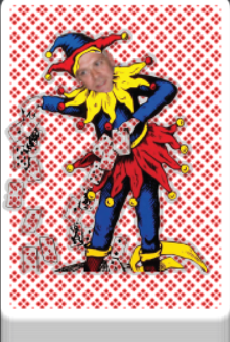
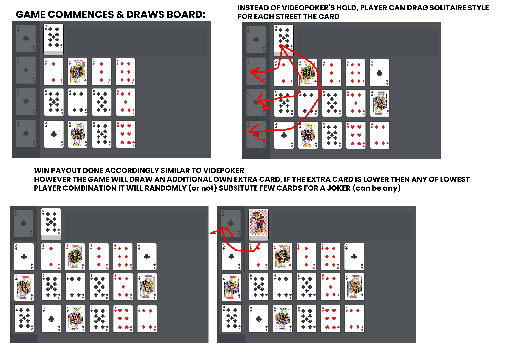
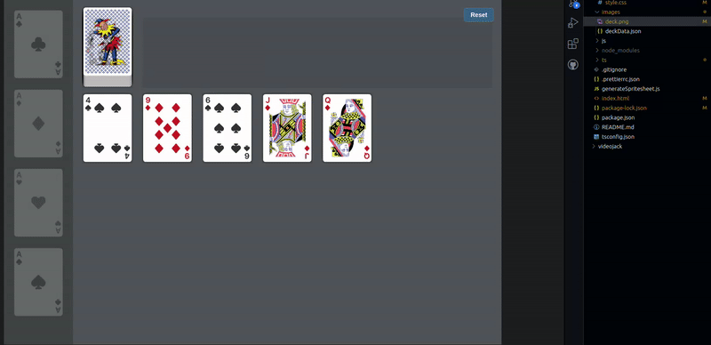
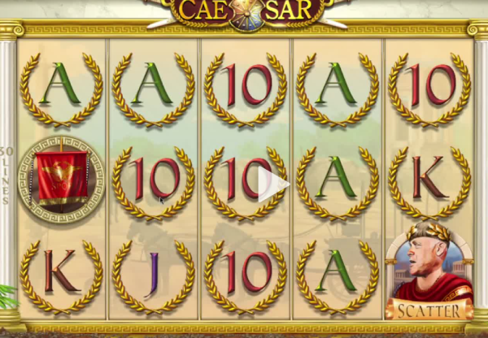

# joker poker: meet & beat the biggest joke within casino industry

i got no clue on how to calculate rtp cause i'm being bullied by a 60 year old man from warren farm in u.k. 

though important to note that in similar way you can embed 'slot' mechanic within the rather bland (and boring) video poker, as the joker mechanic should be a slot-esque payout (meaning not predefined in hard rules like video poker itself)

the idea was born few hours ago i got nobody to make it together with or for so whatever but aslong base game is profitable (and it should be, because u are basically making it so people are holding whole games opposed to 3 cards & re-betting the win+initial bet by making incremental joker games, whilst adding an bonus adjecative to the game that should maybe interest younger crowds to start playing video poker more also)

please note best prolly is to make close to solitaire experience, by making on win option to bet again, so it drags on or actual makes u 'hold' games, also to familiarize people, you could make games being able to shoe (like 3card poker) mixed in, or for example make it look more reconizable to solitaire for newer players by making 'holded games' (gamble/risk) actually stack cards overlayed on each other like (just showing suit/rank)

keep players playing by making every game 'async', so players can decide to 'cash in' or out individual streets, this way also will keep players playing longer because they are prone to stay even after a very big win because they still are in other streets playing/active etc etc.

//

super jackpots (to go around legislation on max. multiplier payouts if to put in offline casino solution) can be based on hand rankings (get 3x flush spades in a row, win 5x in same street) and so on. 

//

also if david to re-use himself this game (i know he would never credit anyhow and pay money to me but regardless cause i refuse to be like him: is to just re-use his playson branded character for the firejoker, i believe it was).

it's used so much and is reconizable, also cause it's old mascotte/character it is prone to be more of liking to the older gents that are more often going to be playing videopoker-esque opposed to trippywin kind of people

**make incremental stages so win (and loss) is endless**

#### game speed
needs be fast asf, probably also hotkey instead of dragging card to acetraps/holders or even key pressed on offline videopoker

# screenshot

# example animation

gif and a vid:

## Video in streaming service: [streamable](https://streamable.com/uglo8g) / local: [joker_david.webm](joker_david.webm)

#### __VERY IMPORTANT THIS IS ONLY PRE BONUS GAME, BUT IDEAS ARE ENDLESS, BUT IN MY OPINION SHOULD MAKE IT AS CLOSE TO SOLITAIRE, THAT MEANS "CONTINUE" BETS (gamble/risk) AND THEN TO ACTUALLY HOLD YOUR WHOLE CURRENT WINS INSTEAD OF INDIVIDUAL CARDS HOLDING/SHOE'ING__

#### from the makers of: Age of David

#### sponsored by
soon available on the next amino ARIA and in every TAFFER venue!

